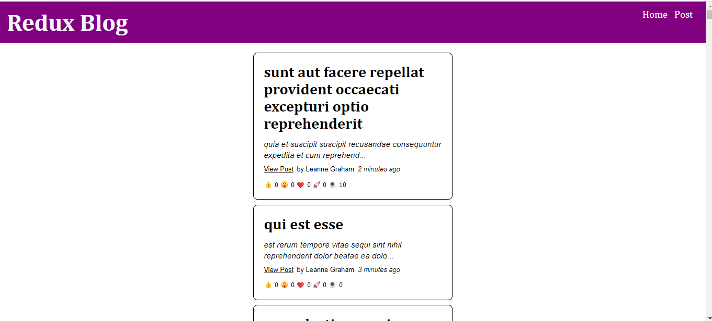

# Blog App

A small blog application.

## Table of contents

- [Overview](#overview)
  - [The app](#the-app)
  - [Screenshot](#screenshot)
  - [Built with](#built-with)
  - [Used Features](#used-features)
- [Author](#author)

## Overview

### The app

Users should be able to:

- View the optimal layout depending on their device's screen size
- They can examine the detailed information of the post they want from the post list returned from the API.
- They can edit the posts
- They can delete the posts
- They can add their own posts
- They can react with emojis.

### Screenshot

### Built with

- React.JS
- CSS custom properties
- Redux 
- ReduxJs Toolkit
- Async Thunks

### Used Features
- useState
- useEffect
- useSelector
- useDispatch
- createAsyncThunk
- createSlice
- configureStore
- Routers
- REST API

## Author

- Website - [Damla Kara](https://www.linkedin.com/in/damla-kara-348081232/)